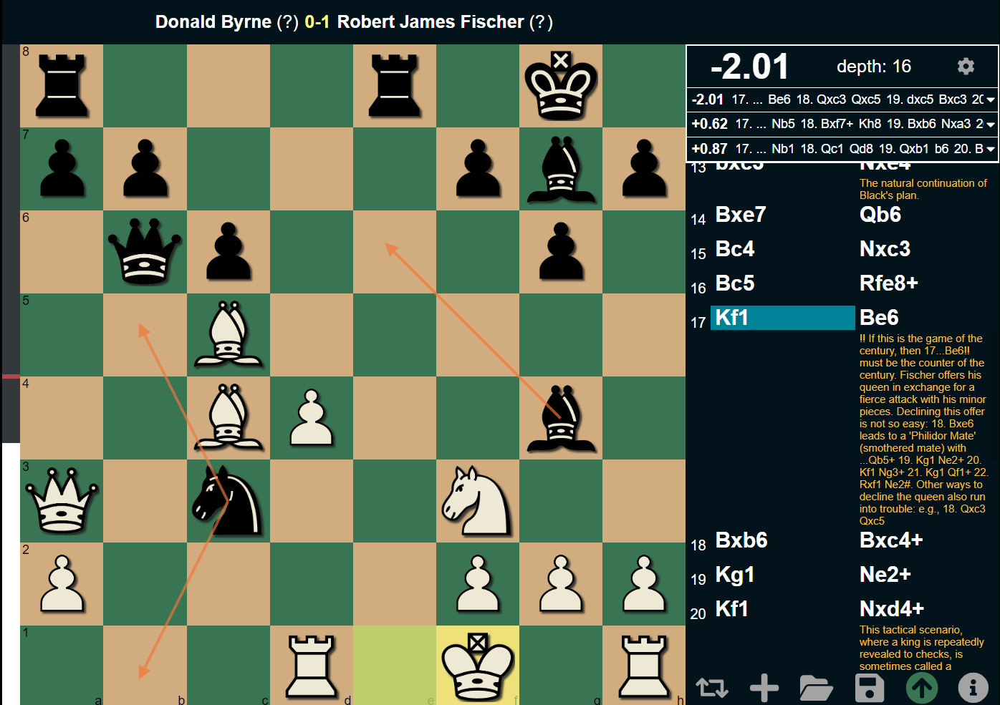

# Atom Chess

A Chess Engine GUI for analysis and storing games.

---
## Download
Download the latest version on the [release](https://github.com/awbridgers/atom-chess/releases) page.
## Features
  * Engine Analysis with Stockfish 17 with ability to change depth
  * Eval bar to quickly visualize which side is winning
  * Engine score with top 3 continuations
  * "Best Move" arrows to quickly show what the best move is
  * Ability to add comments to the move list
  * Save and load games locally into your own database
  
  ### Author
  Adam Bridgers
